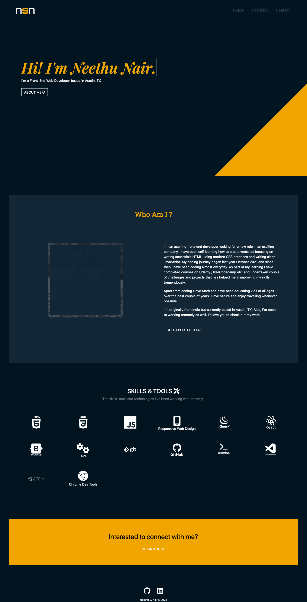
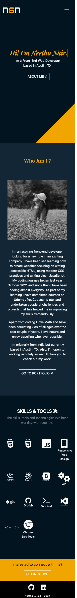

# My Portfolio Website

## Table of contents

- [Overview](#overview)
  - [The challenge](#the-challenge)
  - [Screenshot](#screenshot)
  - [Links](#links)
- [My process](#my-process)
  - [Built with](#built-with)
- [Author](#author)

## Overview

### The challenge

Users should be able to:

- View the optimal layout for the site depending on their device's screen size
- See active states for all interactive elements on the page.
- Should be able to navigate through different pages.

### Screenshots

#### Desktop Design

#### Mobile Design

### Links

- Live Site URL: https:/www.neethunair.com

## My process

### Built with

- Semantic HTML5 markup
- CSS custom properties
- React
- Javascript

## Author

- Frontend Mentor - [@nees101](https://www.frontendmentor.io/profile/nees101)
- Github - [@nees101](https://www.github.com/nees101)
